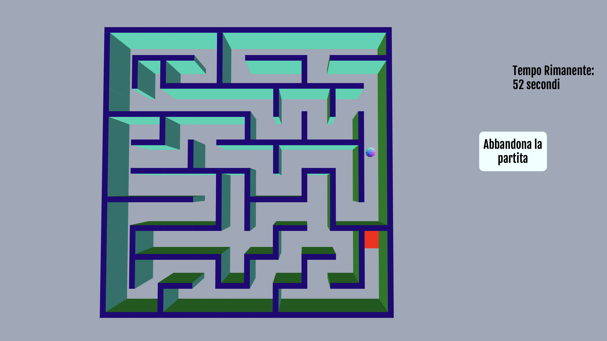

# ProgettoPI

A simple game made with JS, HTML and Three.js for an university project.



You can use the following command to start the server:
```
node server.js
```
Then you can navigate to localhost:8089 to play the game.

There is also the possibility to play the game using the accelerometer of a smartphone but actually this feature seems broken and i need to fix it.
